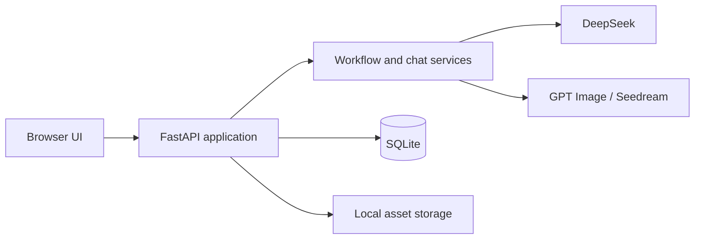

# FilmPilot

[English](README.md) | [简体中文](README.zh-CN.md) · **v1.0.0**

FilmPilot is a local-first AI workspace for filmmaking pre-production. It turns a screenplay into structured scenes and shots, manages reusable visual assets, generates production prompts, and lets creators review AI-proposed edits before applying them.

## Features

- Create, version, approve, and AI-generate screenplays.
- Extract and manage character, location, and prop assets.
- Generate structured storyboards with dialogue-aware shot durations.
- Repair references, numbering, and duplicate shots locally before validation.
- Generate initial-frame and multi-frame storyboard prompts.
- Generate asset reference images with GPT Image or Seedream.
- Use scoped AI chat to propose, review, apply, and revert project edits.
- Inspect model calls, validation results, latency, and token usage.
- Keep project data, generated files, and API credentials on your machine.

## Technology and architecture

- **Backend:** Python 3.11+, FastAPI, Pydantic, SQLAlchemy
- **Frontend:** Vanilla JavaScript, HTML, and CSS; no frontend build step
- **Storage:** SQLite plus local filesystem storage
- **AI providers:** DeepSeek for text workflows; OpenAI GPT Image and Volcengine Seedream for optional image generation
- **Quality:** Pytest and Ruff



FilmPilot is a local-first monolith: the browser UI and REST API are served by one FastAPI process. Service modules isolate model orchestration and deterministic validation, while SQLAlchemy persists projects, scripts, shots, assets, prompts, chat proposals, snapshots, and agent-run metrics.

## Requirements

- Python 3.11 or newer
- `pip` and Python virtual environments
- A DeepSeek API key for screenplay, storyboard, prompt, and chat generation
- Optional OpenAI or Volcengine Ark credentials for image generation

## Installation

### Windows PowerShell

```powershell
git clone https://github.com/thomaschaochao/FilmPilot.git
cd FilmPilot
py -m venv .venv
.venv\Scripts\python -m pip install -e ".[dev]"
Copy-Item config.local.env.example config.local.env
```

### macOS and Linux

```bash
git clone https://github.com/thomaschaochao/FilmPilot.git
cd FilmPilot
python3 -m venv .venv
.venv/bin/python -m pip install -e ".[dev]"
cp config.local.env.example config.local.env
```

Open `config.local.env` and add the provider keys you intend to use:

```dotenv
FILMAGENT_DEEPSEEK_API_KEY=your_deepseek_key
FILMAGENT_OPENAI_API_KEY=your_openai_key
FILMAGENT_ARK_API_KEY=your_volcengine_ark_key
```

The `FILMAGENT_*` prefix is retained for compatibility with existing FilmPilot installations. Never commit `config.local.env` or real API keys.

## Run

Windows:

```powershell
.venv\Scripts\python -m uvicorn app.main:app --reload
```

macOS and Linux:

```bash
.venv/bin/python -m uvicorn app.main:app --reload
```

Open [http://127.0.0.1:8000](http://127.0.0.1:8000). Interactive API documentation is available at [http://127.0.0.1:8000/docs](http://127.0.0.1:8000/docs), and the health endpoint is `/api/v1/health`.

## Data and security

- SQLite data is stored under `data/` by default.
- Generated and uploaded files are stored under `storage/`.
- `.env`, `config.local.env`, `deepseekapi.txt`, databases, generated files, caches, and test artifacts are ignored by Git.
- Provider keys are only read server-side and are not returned by API responses.
- Back up `data/` and `storage/` before upgrading or moving an installation.

## Development

```powershell
.venv\Scripts\ruff check app tests
.venv\Scripts\pytest
node --check app/static/app.js
```

On macOS or Linux, replace `.venv\Scripts\` with `.venv/bin/`.

FilmPilot follows [Semantic Versioning](https://semver.org/): patches use `1.0.x`, backward-compatible features use `1.x.0`, and breaking changes increment the major version. See [CHANGELOG.md](CHANGELOG.md) for release notes.

## License

FilmPilot is released under the [MIT License](LICENSE).
