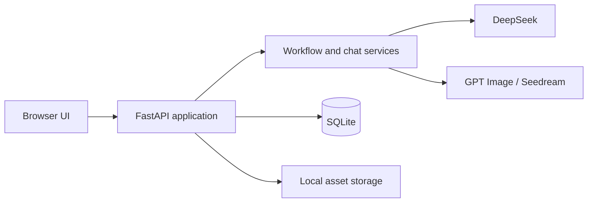

# FilmPilot

[English](README.md) | [简体中文](README.zh-CN.md) · **v1.0.0**

FilmPilot is a **locally run companion for AI video generation**. It prepares and manages the creative material that video-generation models need: characters, scenes, scripts, shot lists, reference images, and production-ready prompts. FilmPilot does not replace a video-generation model; it helps creators build consistent inputs and a repeatable workflow before sending shots to one.

Its main goal is to keep character and visual assets consistent across a project while assisting screenplay development, asset-prompt writing, shot breakdown, and shot-image prompt generation.

## Features

- **Local project workspace:** run the application and retain project data, generated files, and credentials on your own machine.
- **Character and asset management:** extract, create, and manage reusable characters, locations, props, and their reference images.
- **Screenplay assistance:** create, version, approve, generate, and revise screenplays with AI assistance.
- **Asset prompt assistance:** generate consistent prompts for character designs, scene/location designs, and key props.
- **Shot breakdown assistance:** turn an approved screenplay into structured scenes and shots with dialogue-aware durations.
- Repair references, numbering, and duplicate shots locally before validation.
- **Shot prompt assistance — Initial Frame mode:** generate a prompt for the single opening image of a shot.
- **Shot prompt assistance — Storyboard mode:** generate a 4-, 6-, or 9-frame sequential storyboard prompt showing the shot's visual progression.
- Generate asset reference images with GPT Image or Seedream.
- Use scoped AI chat to propose, review, apply, and revert project edits.
- Inspect model calls, validation results, latency, and token usage.

## Agent-assisted prompt workflow

FilmPilot includes a Master Production Agent that helps users move from a rough creative idea to usable generation prompts. The agent is designed as a workflow partner: it asks for missing story facts, turns the answers into a staged production plan, and waits for user approval before applying changes to the project.

The assisted workflow covers:

1. **Project and story clarification:** collect genre, tone, characters, setting, visual style, and production constraints.
2. **Script assistance:** help draft, revise, and approve a screenplay that can become the source of truth for later stages.
3. **Asset planning:** identify characters, locations, props, and visual references that need consistent image prompts.
4. **Shot breakdown:** split the approved script into scenes and shots, preserve dialogue context, and use local validation to repair numbering, references, and duplicates.
5. **Prompt generation:** create asset prompts, shot initial-frame prompts, and storyboard prompts for 4-, 6-, or 9-frame visual progression.
6. **Review and iteration:** continue the work through chat, inspect suggested changes, and apply or reject edits with scoped approvals.

When optional extras are installed, FilmPilot can use local retrieval and CrewAI-style role orchestration to keep agent decisions grounded in the current project. If those extras are unavailable, the same workflow falls back to the built-in orchestrator so the local prompt-generation pipeline remains usable.

## Technology and architecture

- **Backend:** Python 3.11+, FastAPI, Pydantic, SQLAlchemy
- **Frontend:** Vanilla JavaScript, HTML, and CSS; no frontend build step
- **Storage:** SQLite plus local filesystem storage
- **Agent layer:** Master Agent workflow, optional local RAG, optional CrewAI runtime, and deterministic approval checkpoints
- **AI providers:** DeepSeek for text, reasoning, and agent workflows; OpenAI GPT Image and Volcengine Seedream for optional image generation
- **Quality:** Pytest and Ruff



FilmPilot is a local-first monolith: the browser UI and REST API are served by one FastAPI process. Service modules isolate model orchestration, retrieval, agent planning, tool execution, and deterministic validation, while SQLAlchemy persists projects, scripts, shots, assets, prompts, chat proposals, snapshots, agent sessions, workflow checkpoints, and agent-run metrics.

## Requirements

- Python 3.11 or newer
- `pip` and Python virtual environments
- A DeepSeek API key for screenplay, storyboard, prompt, and chat generation
- Optional OpenAI or Volcengine Ark credentials for image generation
- Optional `rag`, `tools`, and `agents` Python extras for local retrieval, research tools, and CrewAI orchestration

## Installation

### Windows PowerShell

```powershell
git clone https://github.com/thomaschaochao/FilmPilot.git
cd FilmPilot
py -m venv .venv
.venv\Scripts\python -m pip install -e ".[dev]"
Copy-Item config.local.env.example config.local.env
```

Optional agent extras:

```powershell
.venv\Scripts\python -m pip install -e ".[dev,rag,tools,agents]"
```

### macOS and Linux

```bash
git clone https://github.com/thomaschaochao/FilmPilot.git
cd FilmPilot
python3 -m venv .venv
.venv/bin/python -m pip install -e ".[dev]"
cp config.local.env.example config.local.env
```

Optional agent extras:

```bash
.venv/bin/python -m pip install -e ".[dev,rag,tools,agents]"
```

Open `config.local.env` and add the provider keys you intend to use:

```dotenv
FILMAGENT_DEEPSEEK_API_KEY=your_deepseek_key
FILMAGENT_OPENAI_API_KEY=your_openai_key
FILMAGENT_ARK_API_KEY=your_volcengine_ark_key
```

The `FILMAGENT_*` prefix is retained for compatibility with existing FilmPilot installations. Never commit `config.local.env` or real API keys.

## Run

Windows:

```powershell
.venv\Scripts\python -m uvicorn app.main:app --reload
```

macOS and Linux:

```bash
.venv/bin/python -m uvicorn app.main:app --reload
```

Open [http://127.0.0.1:8000](http://127.0.0.1:8000). Interactive API documentation is available at [http://127.0.0.1:8000/docs](http://127.0.0.1:8000/docs), and the health endpoint is `/api/v1/health`.

## Data and security

- SQLite data is stored under `data/` by default.
- Generated and uploaded files are stored under `storage/`.
- `.env`, `config.local.env`, `deepseekapi.txt`, databases, generated files, caches, and test artifacts are ignored by Git.
- Provider keys are only read server-side and are not returned by API responses.
- Back up `data/` and `storage/` before upgrading or moving an installation.

## Development

```powershell
.venv\Scripts\ruff check app tests
.venv\Scripts\pytest
node --check app/static/app.js
```

On macOS or Linux, replace `.venv\Scripts\` with `.venv/bin/`.

FilmPilot follows [Semantic Versioning](https://semver.org/): patches use `1.0.x`, backward-compatible features use `1.x.0`, and breaking changes increment the major version. See [CHANGELOG.md](CHANGELOG.md) for release notes.

## License

FilmPilot is released under the [MIT License](LICENSE).
