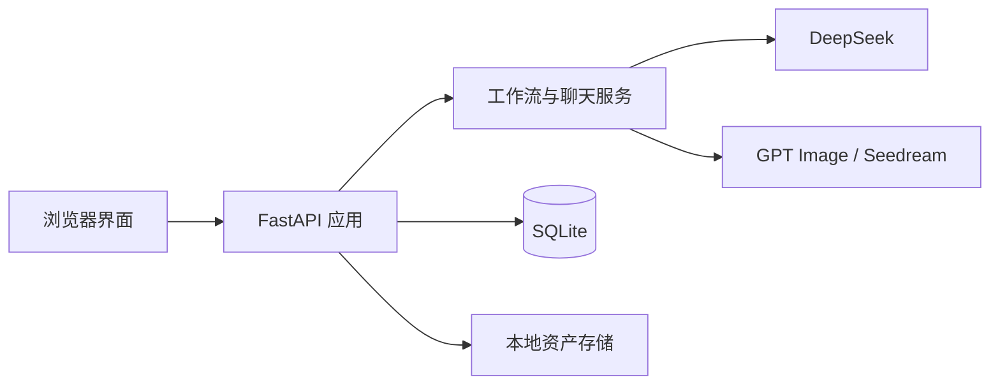

# FilmPilot

[English](README.md) | [简体中文](README.zh-CN.md) · **v1.0.0**

FilmPilot 是一个**在本地运行、用于辅助 AI 视频生成的工具**。它负责准备和管理视频生成模型需要的创作材料，包括人物角色、场景、剧本、镜头列表、参考图片和可直接用于生产的提示词。FilmPilot 本身不是视频生成模型，而是帮助创作者在调用视频模型前获得更一致的输入和可重复的制作流程。

它的核心目标是保持项目中的人物与视觉资产一致，并辅助完成剧本创作、资产提示词编写、镜头拆分和镜头图片提示词生成。

## 核心功能

- **本地项目工作台：** 应用在本机运行，项目数据、生成文件和服务凭证保存在自己的设备中。
- **人物角色与资产管理：** 提取、创建和管理可复用的人物角色、场景、道具及其参考图片。
- **辅助剧本创作：** 创建、版本化、确认、生成和修改剧本。
- **辅助资产提示词生成：** 为人物角色设定、场景设定和关键道具生成一致的图片提示词。
- **辅助分割镜头：** 将确认后的剧本拆分为结构化场次和镜头，并根据对白与动作安排镜头时长。
- 在校验前使用本地逻辑修复引用、编号和重复镜头。
- **镜头提示词——首帧模式：** 为单个镜头生成动作开始时的第一帧图片提示词。
- **镜头提示词——故事板模式：** 生成 4 格、6 格或 9 格连续故事板提示词，展示镜头内部的视觉推进过程。
- 使用 GPT Image 或 Seedream 生成资产参考图。
- 通过限定作用域的 AI 聊天提出、审核、应用和撤销项目修改。
- 查看模型调用、校验结果、延迟和 Token 使用量。

## Agent 辅助提示词工作流

FilmPilot 内置总控制作 Agent，用来帮助用户从一个粗略创意推进到可以使用的生成提示词。这个 Agent 不是直接替用户“一键生成全部内容”，而是作为工作流伙伴：先追问缺失的故事信息，把回答整理成分阶段制作计划，并在用户确认后再把修改应用到项目中。

辅助工作流包括：

1. **项目与故事澄清：** 收集类型、基调、人物、场景、视觉风格和制作约束。
2. **剧本辅助：** 帮助起草、修改和确认剧本，让剧本成为后续资产和镜头生成的事实基准。
3. **资产规划：** 识别需要保持一致的人物、场景、道具和视觉参考，并辅助生成对应图片提示词。
4. **分割镜头：** 将已确认剧本拆分为场次和镜头，保留对白上下文，并通过本地校验修复编号、引用和重复镜头。
5. **提示词生成：** 生成资产提示词、镜头首帧提示词，以及 4 格、6 格或 9 格故事板形式的镜头视觉推进提示词。
6. **审核与迭代：** 通过聊天继续推进工作，查看建议修改，并在限定作用域内应用或拒绝变更。

安装可选扩展后，FilmPilot 可以使用本地检索和 CrewAI 风格的角色编排，让 Agent 决策更贴合当前项目上下文。即使这些扩展不可用，系统也会回退到内置编排器，保证本地提示词生成流程仍然可用。

## 技术栈与架构

- **后端：** Python 3.11+、FastAPI、Pydantic、SQLAlchemy
- **前端：** 原生 JavaScript、HTML 和 CSS，无需前端构建步骤
- **存储：** SQLite 与本地文件系统
- **Agent 层：** 总控 Agent 工作流、可选本地 RAG、可选 CrewAI 运行时和确定性审批检查点
- **AI 服务：** DeepSeek 负责文本、推理和 Agent 工作流；OpenAI GPT Image 和火山引擎 Seedream 提供可选图片生成
- **质量工具：** Pytest、Ruff



FilmPilot 采用本地优先的单体架构：浏览器界面和 REST API 由同一个 FastAPI 进程提供。服务模块负责模型编排、检索、Agent 规划、工具执行和确定性校验，SQLAlchemy 保存项目、剧本、镜头、资产、提示词、聊天修改方案、快照、Agent 会话、工作流检查点和 Agent 运行指标。

## 环境要求

- Python 3.11 或更高版本
- `pip` 和 Python 虚拟环境
- DeepSeek API Key，用于剧本、分镜、提示词和聊天生成
- 可选的 OpenAI 或火山方舟凭证，用于图片生成
- 可选的 `rag`、`tools` 和 `agents` Python 扩展，用于本地检索、研究工具和 CrewAI 编排

## 安装

### Windows PowerShell

```powershell
git clone https://github.com/thomaschaochao/FilmPilot.git
cd FilmPilot
py -m venv .venv
.venv\Scripts\python -m pip install -e ".[dev]"
Copy-Item config.local.env.example config.local.env
```

可选 Agent 扩展：

```powershell
.venv\Scripts\python -m pip install -e ".[dev,rag,tools,agents]"
```

### macOS 与 Linux

```bash
git clone https://github.com/thomaschaochao/FilmPilot.git
cd FilmPilot
python3 -m venv .venv
.venv/bin/python -m pip install -e ".[dev]"
cp config.local.env.example config.local.env
```

可选 Agent 扩展：

```bash
.venv/bin/python -m pip install -e ".[dev,rag,tools,agents]"
```

打开 `config.local.env`，填写需要使用的服务凭证：

```dotenv
FILMAGENT_DEEPSEEK_API_KEY=your_deepseek_key
FILMAGENT_OPENAI_API_KEY=your_openai_key
FILMAGENT_ARK_API_KEY=your_volcengine_ark_key
```

为兼容已有安装，环境变量继续使用 `FILMAGENT_*` 前缀。不要提交 `config.local.env` 或任何真实 API Key。

## 启动

Windows：

```powershell
.venv\Scripts\python -m uvicorn app.main:app --reload
```

macOS 与 Linux：

```bash
.venv/bin/python -m uvicorn app.main:app --reload
```

访问 [http://127.0.0.1:8000](http://127.0.0.1:8000)。交互式 API 文档位于 [http://127.0.0.1:8000/docs](http://127.0.0.1:8000/docs)，健康检查接口为 `/api/v1/health`。

## 数据与安全

- SQLite 数据默认保存在 `data/`。
- 生成及上传文件保存在 `storage/`。
- `.env`、`config.local.env`、`deepseekapi.txt`、数据库、生成文件、缓存和测试产物均被 Git 忽略。
- 服务商密钥仅在服务端读取，不会通过 API 响应返回。
- 升级或迁移安装前，请备份 `data/` 和 `storage/`。

## 开发与测试

```powershell
.venv\Scripts\ruff check app tests
.venv\Scripts\pytest
node --check app/static/app.js
```

在 macOS 或 Linux 上，将 `.venv\Scripts\` 替换为 `.venv/bin/`。

FilmPilot 遵循[语义化版本](https://semver.org/lang/zh-CN/)：修复版本使用 `1.0.x`，向后兼容的新功能使用 `1.x.0`，破坏性变更升级主版本。版本记录参见 [CHANGELOG.md](CHANGELOG.md)。

## 许可证

FilmPilot 使用 [MIT License](LICENSE) 发布。
